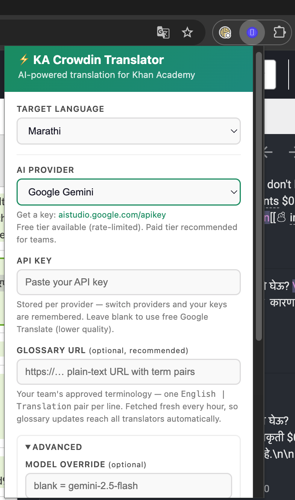
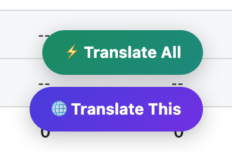
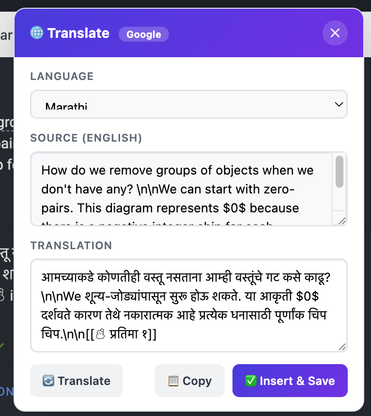

# KA Crowdin Translator

A Chrome extension that batch-translates Khan Academy content on the [Crowdin](https://crowdin.com) translation portal using AI — **bring your own API key** (Google Gemini, OpenAI, or Anthropic Claude) and translate entire exercises in one click while keeping math, widgets, and formatting perfectly intact.

Built by the Khan Academy India localization team, now available for every KA language community worldwide.

---

## Why this exists

Khan Academy translators work string-by-string on Crowdin's in-context (JIPT) interface: click a string, read the English, type the translation, save, repeat — thousands of times per course. Machine-translation suggestions exist but regularly break LaTeX math, drop Perseus widgets, and ignore subject terminology.

This extension automates the whole loop:

1. Finds every untranslated string on the page
2. Translates each one with the AI provider of your choice — guided by your team's terminology glossary
3. Inserts and saves the translation back into Crowdin
4. Shows live progress — you watch, review afterwards, and fix only what needs fixing

Translators in our pilots reported **2–3× faster throughput** on math content, with the AI handling the repetitive strings and humans focusing on review and the genuinely tricky sentences.

## Features

- **⚡ Translate All** — batch-translate every untranslated string on the current page
- **🌐 Translate This** — translate a single string with manual review before saving
- **Bring your own AI** — Google Gemini, OpenAI, or Anthropic Claude; each provider's key is stored separately so you can switch anytime. Optional model override for any provider.
- **Math & widget protection** — LaTeX (`$x^2$`, `$$…$$`, `\begin{align}…`), Perseus widgets (`[[☃ radio 1]]`), URLs, HTML, and markdown structure are replaced with placeholder tokens before translation and restored verbatim afterwards. The AI never gets a chance to mangle them.
- **Glossary-guided terminology** — point the extension at a plain-text glossary URL (a published Google Sheet, GitHub raw file, or Gist). Every translation request includes your team's approved terms. Separate URLs supported for math vs science, auto-selected from the page.
- **Within-batch consistency memory** — the extension feeds the AI its recent translations from the same exercise so recurring terms are translated identically every time.
- **75+ target languages** — every language Crowdin and the major AI providers support.
- **Graceful fallback** — no API key? The extension falls back to free Google Translate (lower quality, still placeholder-protected).
- **Rate-limit aware** — automatic pacing and retry for free-tier API quotas.

## Installation

The extension is not on the Chrome Web Store — you load it as an "unpacked" extension (2 minutes, no developer knowledge needed):

1. **Download** this repository — click the green **Code** button → **Download ZIP** — and extract it somewhere permanent (e.g. `Documents/ka-crowdin-translator/`). Chrome reads the folder directly, so don't delete it later.
2. Open Chrome and go to `chrome://extensions/`
3. Toggle **Developer mode** on (top-right corner)
4. Click **Load unpacked** (top-left) and select the extracted folder (the one containing `manifest.json`)
5. Pin the extension: click the puzzle-piece 🧩 icon in the toolbar, then the pin next to **KA Crowdin Translator**

## Getting an API key

You need an API key from **one** of these providers. All three offer pay-as-you-go pricing; typical cost is **well under $1 per day** of heavy translation work.

| Provider | Get a key at | Default model | Notes |
|---|---|---|---|
| **Google Gemini** | [aistudio.google.com/apikey](https://aistudio.google.com/apikey) | `gemini-2.5-flash` | Free tier available (15 requests/min, 1,500/day). Paid tier removes limits. |
| **OpenAI** | [platform.openai.com/api-keys](https://platform.openai.com/api-keys) | `gpt-4o-mini` | Requires a funded platform account. |
| **Anthropic Claude** | [console.anthropic.com/settings/keys](https://console.anthropic.com/settings/keys) | `claude-haiku-4-5-20251001` | Requires a Console account with credits. |

> **Teams:** one shared paid key with a monthly budget alert is usually simpler than individual keys. Share it privately (never in public docs), and rotate it periodically.

## Configuration

Click the extension icon to open the settings popup:

1. **Target Language** — the language you translate into. On language subdomains (e.g. `mr.khanacademy.org`) the extension auto-detects the language from the URL and this setting is overridden.
2. **AI Provider** — pick Gemini, OpenAI, or Claude.
3. **API Key** — paste the key for the selected provider. Keys are remembered per provider.
4. **🧪 Test** — sends a one-line test translation so you can verify the key works before running a batch.
5. **Advanced** (optional):
   - **Model override** — use a different model than the default (e.g. `gemini-2.5-pro`, `gpt-4o`, `claude-sonnet-4-5`).
   - **Glossary URLs** — see [Glossary guide](#glossary-guide) below.
6. **Save Settings.**


## Usage

1. Go to a Khan Academy translation portal page, e.g.
   `https://<lang>.khanacademy.org/devadmin/translations/edit/…`
2. Two floating buttons appear bottom-right:
   - **⚡ Translate All** — translates and saves every untranslated string on the page, with a progress overlay (pause anytime with ⏹ Stop)
   - **🌐 Translate This** — opens a panel for the currently selected string: translate, review/edit the output, then Insert & Save
   

3. Review the results in Crowdin as you normally would. AI output is a draft for human review, not a replacement for it.


## Glossary guide

The single highest-impact quality lever. A glossary is a plain-text file of approved term pairs:

```
prime number | ಅವಿಭಾಜ್ಯ ಸಂಖ್ಯೆ
photosynthesis | प्रकाशसंश्लेषण
refractive index | अपवर्तनांक
```

- One `English | Translation` pair per line; lines starting with `#` are comments
- Host it at any URL that returns plain text:
  - **GitHub raw file or Gist** (recommended — version-controlled, free)
  - **Published Google Sheet** (File → Share → Publish to web → CSV/TSV)
- Paste the URL into the popup. The extension fetches it fresh every hour, so glossary updates reach every translator automatically — no reinstall needed.
- Up to ~50,000 characters (≈1,000–1,500 terms) are included per request.
- **Subject-aware URLs**: if you maintain separate math and science glossaries, set both — the extension detects the subject from the page URL and loads the matching one.

**Workflow that worked for us:** a language lead owns one glossary sheet per subject; translators flag wrong terms during review; the lead updates the sheet; everyone's next batch uses the fix.

## How it works (technical)

```
┌────────────────────── Khan Academy page (top frame) ──────────────────────┐
│  .crowdin_jipt_untransl elements  ←  finds & clicks each untranslated one │
│      │                                                                    │
│      │  window.postMessage (GET_STATE / INSERT_SAVE)                      │
│      ▼                                                                    │
│  ┌── Crowdin iframe (cross-origin) ──┐                                    │
│  │ source extraction · text insert · │                                    │
│  │ save-button detection             │                                    │
│  └───────────────────────────────────┘                                    │
└───────────────────────────────────────────────────────────────────────────┘
```

- `content.js` runs in **both frames** (`all_frames: true`) and detects its context via `window === window.top`.
- Before any text reaches an AI, every protected pattern (LaTeX, widgets, URLs, HTML, markdown markers) is replaced with a single **Unicode Private-Use-Area character** (U+E000–U+F8FF). These survive every translation engine untouched and are restored byte-for-byte afterwards. If the model drops even one token, the translation is rejected and retried through the fallback path.
- The AI request includes: translation rules (terminology, gender agreement, polysemy, transliteration policy), your glossary, and the last ~12 translations from the current batch for consistency.
- Multi-line math environments (`$\begin{align}…\end{align}$`) are tokenized before line-splitting so they always travel as one unit.

## Troubleshooting

| Symptom | Fix |
|---|---|
| Buttons don't appear | Refresh the page. Confirm you're on a `khanacademy.org` translation URL and the extension is enabled. |
| "Extension context invalidated" in console | You reloaded the extension while the page was open — refresh the page. |
| Test button fails with 401/403 | Wrong or expired API key, or the key's account has no credit. |
| Test fails with 429 | Rate limit / quota exhausted. Gemini free tier resets daily (midnight Pacific). Wait or upgrade to paid. |
| Strings skipped during a batch | Open DevTools → Console → filter `[KAT]` to see the reason per string (already translated, UI text, rate limit, etc.). |
| Translations save but look wrong | Check the glossary is loading: console shows `[KAT] Loaded … glossary`. Improve the glossary — it's the biggest quality lever. |
| Overlay says "Google Translate" instead of your provider | No API key saved for the selected provider — open the popup and check. |

Console debugging: DevTools on the KA page, filter by `[KAT]` (top frame) or `[KAT iframe]` (Crowdin panel).

## Privacy & cost notes

- Source strings are sent to the AI provider you configure (Google, OpenAI, or Anthropic) under **your** API key and their API terms. No data is sent anywhere else; the extension has no backend and collects nothing.
- API keys are stored in `chrome.storage.sync` (synced to your Chrome profile). Never commit keys to a repository or share them in public channels.
- Rough cost guide with default models: a 50-string exercise ≈ $0.01–0.05 depending on provider. Set a billing alert on your provider account.

## Contributing

Not accepting contributions.

## Repository layout

```
├── manifest.json    # Chrome MV3 manifest
├── content.js       # All logic: frame handling, tokenization, AI providers, batch loop
├── popup.html       # Settings UI
├── popup.js         # Settings persistence + per-provider key test
├── styles.css       # Injected button/overlay styles
└── icons/           # Extension icons
```

## License

MIT (see `LICENSE`).
